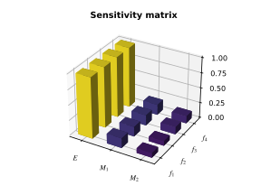
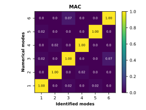

# FE model updating in Python

Finite element (FE) model updating in Python by an example. The framework of sensitivity-based FE model updating is implemented in Python and validated through a simple numerical case study utilizing any release of the FE model program ABAQUS.

Please cite both the original research paper which the code was developed for [1], and the code [2], if used for research purposes.

## Installation
The files can be used directly by downloading or cloning/forking the repository. Note that the FE model software ABAQUS is required to run the files (currently up to and including Abaqus version 2025 is tested and supported).

## Content

  

FE model updating is performed by considering a simply supported beam. The files include:
- Implementation of the *theoretical framework* of sensitivity-based FE model updating by perturbation analysis.
- Demonstration of an *analysis framework*, or workflow setup, utilizing the numerical FE model program ABAQUS.
- [Description of a numerical case study](https://www.researchgate.net/publication/354380166_FE_model_updating_in_Python), including results for validation.

Experience with ABAQUS and ABAQUS scripting is not needed, but preferable, for an increased understanding of the numerical case study implementation. The workflow setup is general and the theoretical framework of the model updating can be utilized with other FEM programs by simple modifications to the provided files.

The easiest way to get into the use and understanding is to download and run the example files in the following order:
 - Navigate to the folder "01_Initial/01_FE_model" and run the file *abaqus_run_file.py* to generate model files for your current ABAQUS version.
 - Navigate back to the main folder and run *01_run.py* for the model updating and *02_run_pp.py* for the post-processing of the results.
 
For additional details of theory, implementation and use, please see the references below. Examples of results from the postprocessing is shown in the [description of the numerical case study](https://www.researchgate.net/publication/354380166_FE_model_updating_in_Python).

## Other
The analysis framework is established using Python version 3.7.2, including Scipy version 1.3.2. The numerical FE model currently works with ABAQUS/CAE up to and including release 2025.

## Support

Please [open an issue](https://github.com/bjorntsv/pyfemu/issues/new) for support.

## References
[1]	B. T. Svendsen, Ø. W. Petersen, G. T. Frøseth, and A. Rønnquist, “Improved finite element model updating of a full-scale steel bridge using sensitivity analysis,” Struct. Infrastruct. Eng., pp. 1–17, Jul. 2021, doi: https://doi.org/10.1080/15732479.2021.1944227.

[2]	B. T. Svendsen, “FE model updating in Python.” 2020. doi: http://doi.org/10.5281/zenodo.4243875.