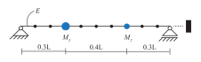

# FE model updating in Python

Finite element (FE) model updating in Python by an example. The framework of sensitivity-based FE model updating is implemented in Python
and validated through a simple numerical case study utilizing the FE model program ABAQUS.

Please cite both the original research paper which the code was developed for (reference to be included), and the code, if used for research purposes.

## Installation
The files can be used directly by downloading or cloning the repository. Note that the FE model software ABAQUS is required to run the files.

## Content

  

FE model updating is performed by considering a simply supported beam. The files include:
- Implementation of the *theoretical framework* of sensitivity-based FE model updating by perturbation analysis.
- Demonstration of an *analysis framework*, or workflow setup, utilizing the numerical FE model program ABAQUS.
- Description of a numerical case study including results for validation.

Experience with ABAQUS and ABAQUS scripting is not needed, but preferable, for an increased understanding of the numerical case study implementation.
The workflow setup is general and the theoretical framework of the model updating can be utilized with other FEM programs by simple modifications to
the provided files.

The easiest way to get into the use and understanding is to download and run the example files (*01_run.py* and *02_run_pp.py*). For additional details of theory,
implementation and use, please see the reference below.

Examples of results from the postprocessing is shown below (included in the example files).

## Other
The analysis framework is established using Python version 3.7.2, including Scipy version 1.3.2. The numerical FE model is established in ABAQUS/CAE release 2017.

## Support

Please [open an issue](https://github.com/bjorntsv/pyfemu/issues/new) for support.

## References
To be updated.
